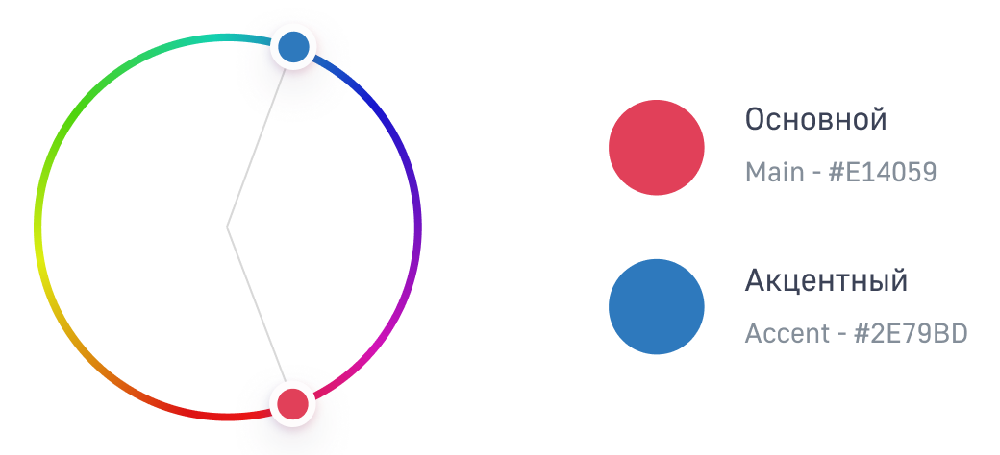
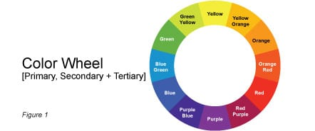
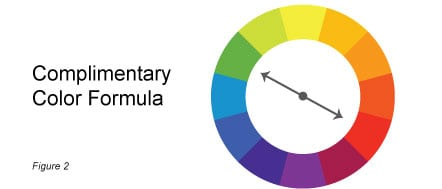
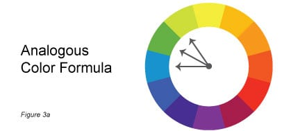
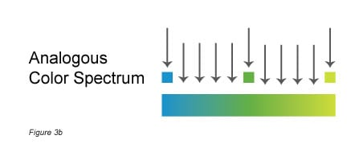
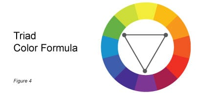
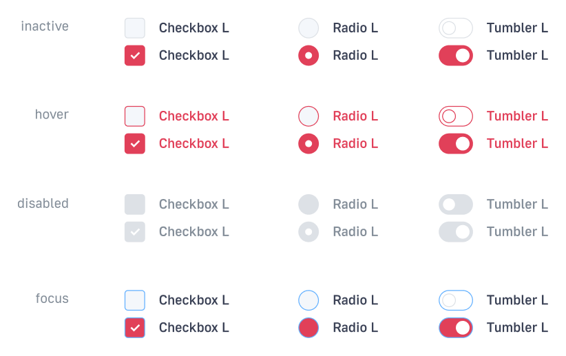

> Если нужно выбрать из существующих наборов: [Наборы цветов](uiuxg_color_palettes.ru.md)

## Основной цвет

Для каждого сайта может быть выбран основной цвет. При подборе следует учитывать, что он будет использоваться для: **ссылок, кнопок** и **заливок больших плашек**. Текст набранный белым на такой плашке должен оставаться читабельным. В тоже время ссылка внутри текста должна быть явно различима. Не стоит обязательно стараться найти для каждого сайта уникальный, никем не использованный цвет. Цвет может быть подобран близкий к логотипу, или существующей айдентике бренда.

> Пример основного цвета: `#E14059`

## Выбор акцентного цвета

Для сайтов с большим количеством функционала может быть выбран дополнительный акцентный цвет. Так как на таких сайтах много сложных интерфейсных элементов, и нужно разделить основные и второстепенные действия. Для выбора акцентного цвета, нужно использовать сочетание двух цветов, расположенных на расстоянии от одной четверти до одной трети цветового круга.

> Основой: `#E14059` Акцентный: `#2E79BD`

При построении макетов новой ИС необходимо использовать следующие ресурсы для определения основного, вторичного и акцентного цветов и их сочетаемости:

[Colorbox.io](http://www.colorbox.io/)

[Palx - Automatic UI Color Palette Generator](https://palx.jxnblk.com/)

## Цвет фона

В большинстве ИС область контента — это белый `#FFFFFF`. Это помогает сфокусировать внимание и снижает нагрузку на глаза. Серый фон делит контент на смысловые блоки и группирует элементы на странице.

## Настройка палитры

Настройка цветовой палитры следующих параметров остается всегда постоянной для любой ИС:

* Цвета элементов;
* Цвета состояний;
* Рамки;
* Интерактивные и прозрачные элементы.

## Соответствие цветов предметной области

В данном вопросе необходимо прежде всего руководствоваться брендбуком компании, а при его отсутствии находить сопоставление цвета предметной области.

Большинство цветовых схем и правил комбинирования цветов опираются на цветовой круг, который разработан в теории цвета. Для того, чтобы освоить более сложные правила комбинирования цветов, нужна практика, но есть и простые правила. Если в ИС гармонично сочетаются цвета, человек, работающий в ней, лучше распознает и понимает содержащуюся  информацию. Теория цвета — это не ядерная физика и не высшая математика, но это не умаляет ее роли в повышении эффективности работы с интерфейсом. Ниже представлены базовые инструменты для создания правильных цветовых схем:

### Комплементарные цвета

Данная схема позволяет определять противоположные цвета. Схема комплементарных цветов по принципу «противоположности притягиваются».

### Аналоговые цвета

Аналоговая цветовая формула, которую используют многие компании, предполагает сочетание в палитре трех цветов, близких на цветовом круге. Например, если основным цветом является зеленый, гармонично будет смотреться его сочетание с цветами, которые находятся по обе стороны от него на цветовом круге. Расширения палитры можно достичь за счет тех цветов спектра, которые на круге находятся между тремя первоначальными цветами.

### Триадные цвета

Это наиболее сложная из всех простых цветовых формул. Для начала выберите первый цвет, затем два других, так, чтобы воображаемые соединительные линии между ними ними на цветовом круге образовали равносторонний треугольник. Триадная схема хорошо сбалансирована и гармонична.

## Пример адаптации цветов для ЭИОС ПГМУ

### Цвета

Main: `#E14059`
Second: `#7699B3`
Accent: `#2E79BD`

### Кнопки

> Меняются темы Primary и Empty. Все контролы, содержащие кнопки с этими темами автоматически брендируются.

### Составные контролы

#### Переключатель

#### Пагинация

#### Тогглер

#### Flexberry Menu

### Чекбоксы, радиокнопки, тумблеры

