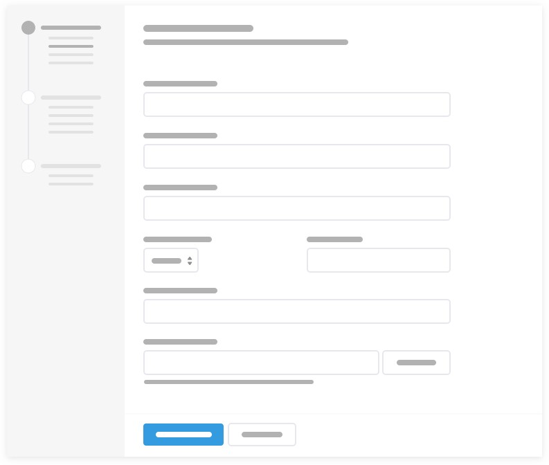
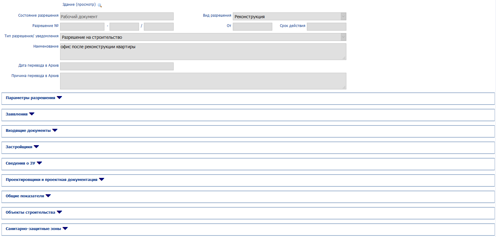
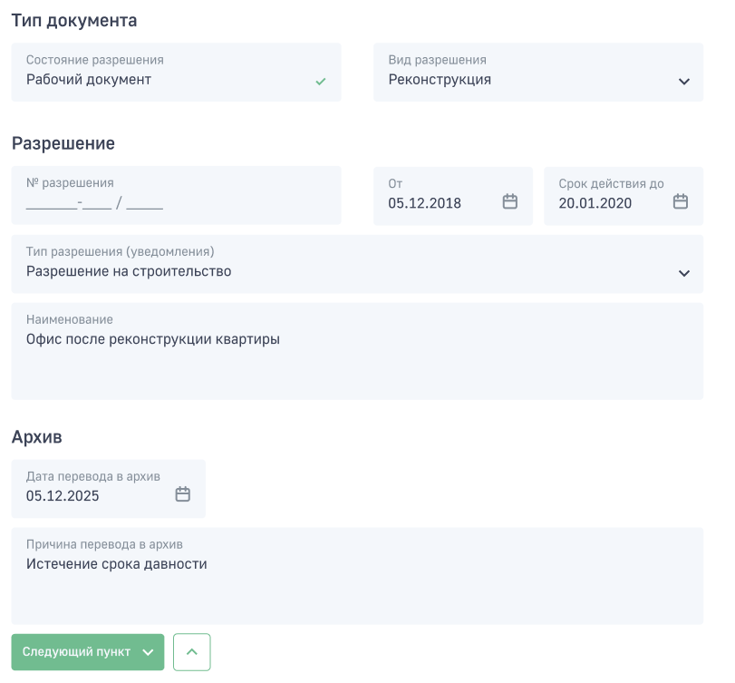
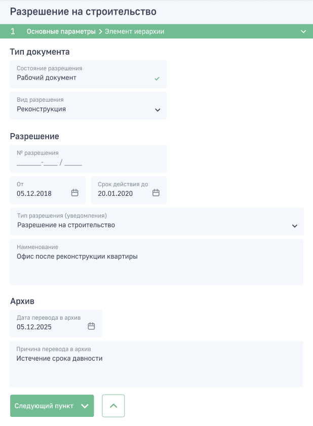
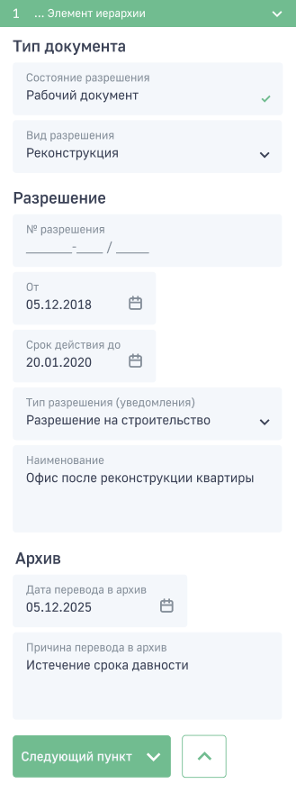

## Использование мастера для заполнения больших форм

Матсер настройки помогает избавиться от загруженных форм и последовательно складывать все компоненты в иерархию бокового меню.

Для эффективной работы данной модели необходимо грамотно планировать все поля и разделы. Чтобы такая модель работала качественноа необходимы следующие условия:

* Отсутствие конфликтующих элементов в разных разделах. Все поля должны быть организованы таким образом, чтобы все конфликты были на одном экране.
* По возможности объединить все возможные поля. Избавиться от лишних полей или сворачивать их.

[Исправить]:// (Правильно структурировать пункты, сократить лишнее)
* Последовательно структурировать все разделы.
* Давать возможность сохранять незаконченные формы.
* Иметь возможность редактировать все обязательные для заполнения поля на одном экране. Можно собирать все эти поля в конце/начале иерархии мастера. Так как обязательные для заполнения поля появляются в зависимости от некоторых выбранных элементов формы нельзя просто сгруппировать их всех на одном экране. По сути пункт с обязательными полями будет динамически меняться в зависимости от содержимого остальных пунктов.

### Реализация мастера для существующей формы

[Прототип в Figma](https://www.figma.com/file/DJ6lDHNM1BM4mNxJn1jPkC/%D0%94%D0%A1-2-%D1%8D%D1%82%D0%B0%D0%BF-%D0%BD%D0%B0%D0%B3%D1%80%D1%83%D0%B6%D0%B5%D0%BD%D0%BD%D0%B0%D1%8F-%D1%84%D0%BE%D1%80%D0%BC%D0%B0?node-id=260%3A39631)

Переработана форма [ИСОГД - Разрешение на строительство](http://isogd:2205/forms/Zdanie/ZdanieWebE.aspx?PK=%7Bb5cdd5e8-1173-4208-aa39-ceed4313ee5d%7D)

[Добавить]:// (Добавить картинку всего интерфейса)

При использования нового метода все вкладки превратятся в пункты мастера по созданию данной записи. Выбранные подсвечиваются зеленым. Красным цветом подсвечиваются неправильно заполненные и конфликтующие пункты. При желании можно развернуть все формы. Это действие будет эквивалентно развороту всех вкладок вручную на старой форме.

По клику на пункт откроется форма для заполнения.

После заполнения пункта можно перейти к следующему нажав на кнопку Следующий пункт. Рядом находится кнопка без подписи которая переводит на предыдущий пункт.

Также эту форму можно просматривать на мобильных устройствах.

В режиме планшета иерархия отображается раскрывающимся меню, которое  можно вызвать кликом на него.

Мобильная версия выглядит также.

В иерархии отображается только последний выбранный пункт

