## Компоненты форм ввода данных

Типичная форма содержит в себе следующие пять компонентов:

* **Структура.** Включает в себя порядок полей, внешний вид формы на странице и логические связи между несколькими полями.
* **Поле ввода.** Включает в себя текстовые поля, поля пароля, флажки, радиокнопки и любые другие поля, предназначенные для ввода.
* **Строки меток.** Обычно поясняют пользователю что означает поле ввода.
* **Кнопки действий.** Производят определенное действие (например, отправка формы) (элемент [Кнопки и тулбар](link_here)).
* **Обратная связь.** Необходимо дать понять, что действие находится в работе или завершилось. Результат действия может быть положительным (успешная отправка) или отрицательным (ошибка) (раздел [Диалоги с системой](uiuxg_dialog_with_a_system.ru.md)).

Формы также могут содержать следующие компоненты:

* **Подсказки.** Объяснение того, как заполнять форму (раздел [Диалоги с системой](uiuxg_dialog_with_a_system.ru.md)).
* **Валидация.** Проверка данных гарантирует, что введенные данные верны.

## Структура формы

Форма – это способ общения с пользователем. Как и любая другая беседа, она должна состоять из логической связи между двумя сторонами: пользователь и приложение.

## Логическая последовательность формы

Выстраивайте логику формы так, чтобы она была понятна с точки зрения пользователя.

## Группировка связанной информации

Группируйте связанную информацию в отдельные блоки и наборы. Группировка связанных полей поможет пользователям разобраться в информации, которую они должны предоставить. Посмотрите как это работает на примере формы контактной информации ниже (тут должен быть [пример](link_here) из макета по группировке в форме)*:

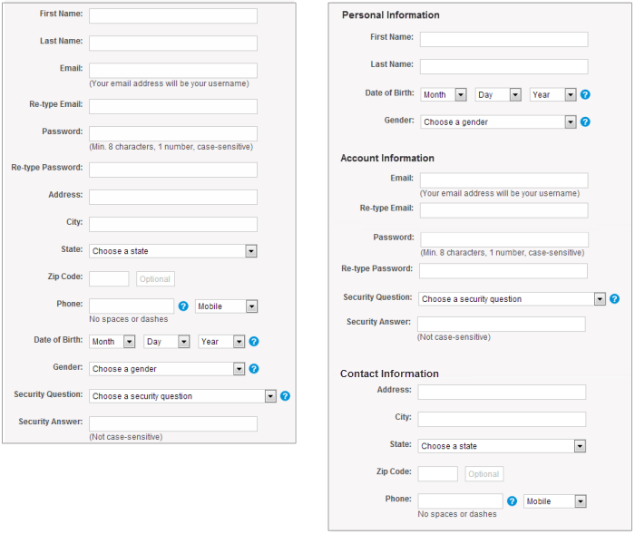

Image: Nielsen Norman Group

## Вкладки, Сворачиваемые разделы. *(когда будет макет)*

## Один столбец vs. Несколько столбцов

Одной из проблем с организацией полей формы в нескольких столбцах является непоследовательная интерпретация пользователями этих полей. Если форма имеет горизонтально расположенные поля, то пользователь должен следовать по Z-образной траектории вдоль формы, что замедляет скорость восприятия и превращает путь к завершению в мешанину. Но если форма составлена в один столбец, то путь к завершению один — вниз страницы.

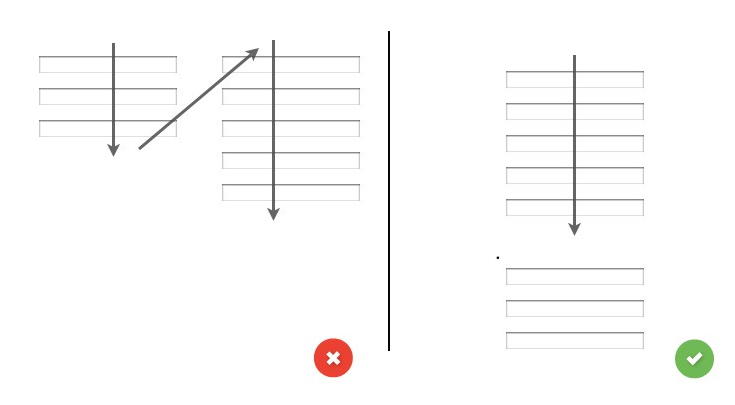

Слева вы видите один из возможных способов интерпретации форм, составленных в несколько столбцов. И противопоставленный ему способ построения формы в один столбец.

### Поля ввода

Поля ввода — это элемент формы, который позволяет пользователям заполнить ее. Существуют различные типы полей для нужной вам информации: текстовые поля, поля пароля, раскрывающиеся списки, флажки, радиокнопки, сборщики информации и др.

### Количество полей

Ключевое правило в дизайне формы гласит, что чем она короче, тем лучше. Таким образом, ваша задача состоит в том, чтобы свести к минимуму количество полей настолько, насколько это возможно. Это сделает ваши формы менее загруженными, особенно когда вы просите ввести много информации. Однако не переусердствуйте, потому что никто не любит формы из трех полей, которые дополнены 30-ю вопросами. В данный момент нормой считается отображение 5–7 полей.

### Обязательное vs. Необязательное

Старайтесь избегать необязательных полей в формах. Но если вы их используете, то, по крайней мере, четко различайте те поля, которые могут быть пустыми.

### Маски ввода информации

Маски ввода информации — это визуальное улучшение, которое помогает отформатировать введенную информацию автоматически. Они появляются тогда, когда пользователь фокусируется на определенном поле ввода, и это форматирование помогает пользователю сосредоточиться на необходимых сведениях и легче подметить возможные ошибки. В приведенном ниже примере круглые скобки, пробелы и тире автоматически применяются при вводе телефона, номера кредитных карт и других данных с числами. Этот способ экономит время и помогает избежать ошибок при вводе числовых значений.

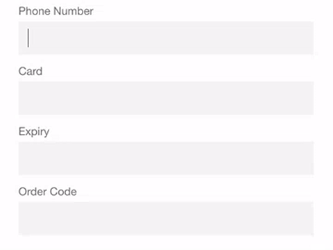

### Desktop-Only: дружим форму с клавиатурой

Пользователи должны иметь возможность сосредоточиться на форме и редактировать каждое поле используя только клавиатуру. Опытные пользователи, которые интенсивно используют клавиатуру, должны иметь возможность легко переходить между полями и редактировать их, не отрывая пальцы от клавиатуры. Вы можете найти детальные требования для взаимодействия с клавиатурой в [рекомендации консорциума W3C](https://www.w3.org/TR/WCAG20-TECHS/G202.html).

### Desktop-Only: Автофокус на поле ввода

Автовыбор поля дает пользователю представление и точку отправки, чтобы быстро заполнять поля формы. Данная техника дает визуальный сигнал о каком-либо изменении, будь то изменение цвета, выцветание в окне, мигающие стрелки или что угодно еще. При создании формы аналитик должен обязательно продумать первое поле для автофокуса и указать его в постановке задачи.

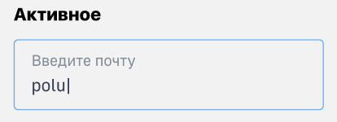

### Mobile-Only: Адаптивная клавиатура по запросу

Пользователи телефонов оценят приложения, которые обеспечивают автоматическое появление адаптивной клавиатуры по запросу в поле ввода. Необходимо реализовать эту возможность последовательно, по всему приложению, а не только для конкретных задач.

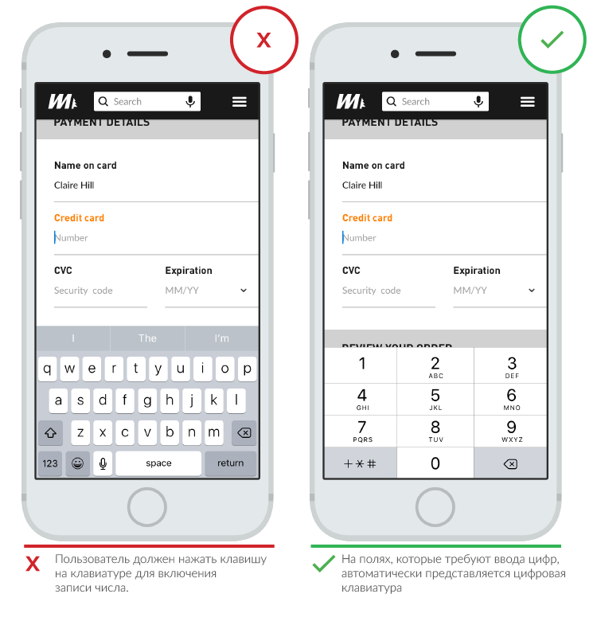
(Image: Google)

### Автозаполнение

Все больше и больше людей используют мобильные экраны, поэтому автозаполнение поможет предотвратить банальные опечатки и позволит улучшить опыт пользователей. Это также относится к вводу с клавиатуры. Например, заполнение полей с адресом, является наиболее проблемной частью любой регистрационной формы. Такой инструмент как автозаполнение адреса (который использует геолокацию, чтобы обеспечить точное определение местоположения пользователя) позволяет пользователям указать свой адрес с меньшим числом нажатий клавиш чем обычные поля ввода.

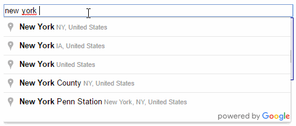

### Метки

Четко прописанные метки являются одним из основных способов сделать интерфейс более доступным. Правильные метки сообщают пользователю о цели поля ввода, сохраняют свою полезность, когда акцент делается на самом поле и остаются видимыми даже после того, как все поля были заполнены. Метки в нашей ДС располагаются прямо внутри поля ввода или строго над ним.

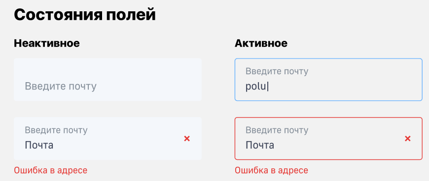

### Количество слов в метках

Метки не могут заменить текст. Необходимо употреблять емкие, короткие и понятные надписи (слово или два), чтобы пользователи могли быстро прочитать вашу форму.

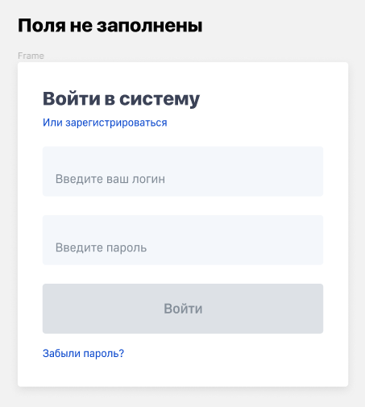

### Заглавные буквы в начале предложения vs. Заглавные Буквы в Начале Слова

В большинстве цифровых продуктов сегодня существует два способа использовать заглавные буквы:

* В начале слова: капитализация каждого слова, кроме предлогов и частиц — «Это Заглавные Буквы».
* В начале предложения: капитализация первого слова в предложении — «Это заглавные буквы».

Второй вариант используется для меток и имеет одно преимущество над первым: его немного проще читать. Если разница для коротких надписей незначительна, то для длинных она уже существенна. Теперь Вы Знаете Насколько Трудно Читать Длинный Текст в Заглавных Буквах.

### Встроенные подсказки (иногда заменяет метку)

Набор подсказок в качестве заполнителя в поле ввода исчезает, как только пользователь фокусируется на этом поле. Хорошее решение для проблемы встроенных подсказок — это плавающий ярлык. Встроенная подсказки будет отображаться по умолчанию, но как только поле ввода будет активировано, встроенная подсказки исчезает.

### Кнопки действий

Нажатие на такую кнопку вызывает какие-то действия, например, отправка формы.

### Первичные действия vs. Вторичные действия

Отсутствие визуального различия между первичными и вторичными действиями могут легко привести к провалу. Увеличение визуальной выразительности вторичных действий минимизирует риск ошибиться и усиливает ощущение движения к успешному результату.

### Расположение кнопки

Сложные формы, как правило, имеют кнопку «Назад». Если такая кнопка расположена прямо над полем ввода (как на первом скриншоте ниже), то пользователь может случайно нажать на нее. Все дело в том, что кнопка «Назад» — это вторичное действие, которое должно быть менее доступным (второй скриншот показывает правильное расположение вторичных кнопок).

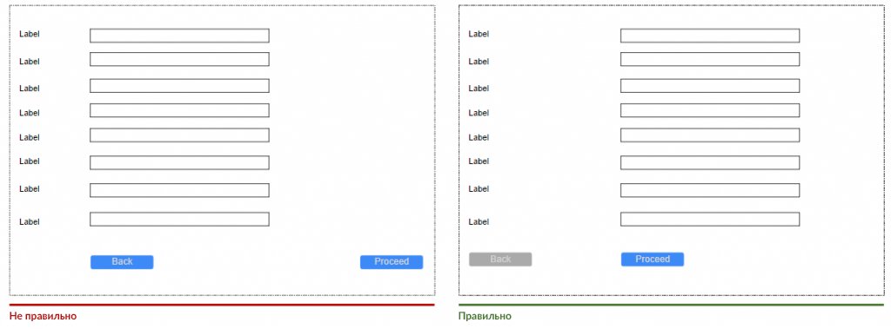

### Правило наименования

Избегайте общих слов, таких как «Отправить» для действия, потому что они создают впечатление, что форма является шаблонной. Вместо этого укажите то действие, которое будет выполняться при нажатии на кнопку, например, «Создать мой аккаунт» или «Подписаться на еженедельные предложения».

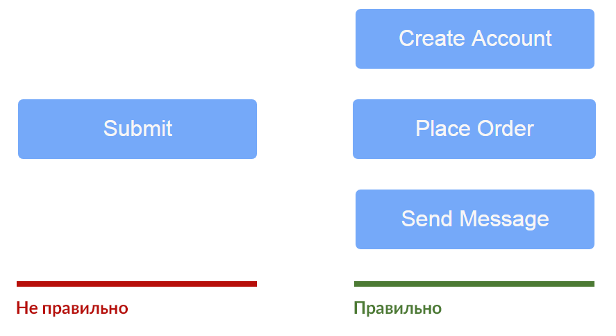

### Кнопки с несколькими действиями

Избегайте кнопок с несколькими действиями, так как они могут отвлекать пользователей от цели заполнения формы.

### Внешний вид

Убедитесь, что кнопки выглядят как кнопки: сделайте индикатор нажатия, если можно.

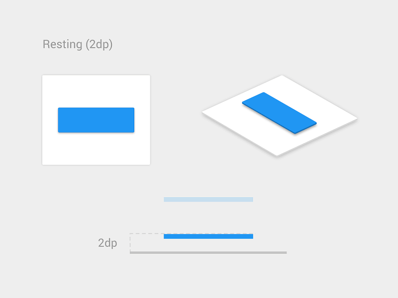

Тень под кнопкой указывает, что ее можно нажать. (Image: Vadim Gromov)

### Микровзаимодействия

Спроектируйте кнопку «Отправить» таким образом, чтобы она ясно показывала, что форма обрабатывается после действий пользователя. Это обеспечивает обратную связь с пользователем и предотвращает двойное нажатие.

(Image: Michaël Villar)

### Проверка

Ошибки при проверке формы неизбежны и являются естественной частью ввода данных (потому что пользователи склонны делать ошибки). Да, ошибки должны быть сведены к минимуму, но они никогда не будут устранены окончательно. Итак, самым важным вопросом является то, как сделать проверку легкой для пользователя, чтобы они смогли исправить ошибки?

### Встроенная проверка

Пользователям не нравится, что приходится заполнять всю форму и в самом конце узнавать об ошибках. Особенно неприятно завершает длинную форму тот факт, что после нажатия кнопки «Отправить», вас награждают несколькими сообщениями об ошибках. Это еще больше раздражает, когда вообще непонятно где были допущены эти ошибки.

(Image: Stack Exchange)

Проверка должна сообщать пользователям о правильности введенного текста, как только они его ввели. Основной принцип проверки формы таков: общайтесь с пользователем! Скажите им — что не так! Встроенная проверка в режиме реального времени незамедлительно информирует пользователя о правильности его данных. Такой подход позволяет им исправлять ошибки быстрее, не дожидаясь, пока они нажмут на кнопку «Отправить».

Однако, избегайте проверки на каждое нажатие клавиши, потому что в большинстве случаев, вы просто не можете быть уверены, что пользователь закончил набирать ответ. Иногда форма должна проверять данные в то время, когда пользователь переходит к новому полю.

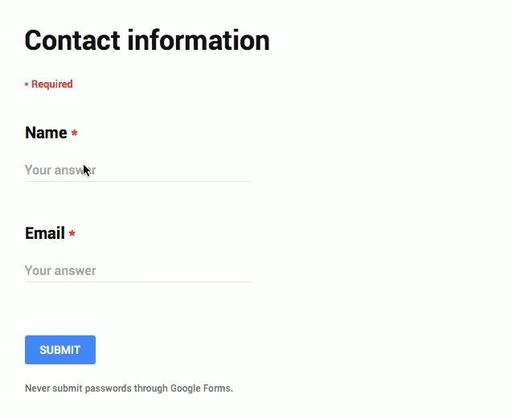
Формы Google указывают, что адрес электронной почты, который вы вводите, недействителен, прежде чем вы закончите печатать. (Image: Medium)

С другой стороны, формы проверки после ввода данных не сообщают пользователю, что он совершил ошибку с достаточной оперативностью.

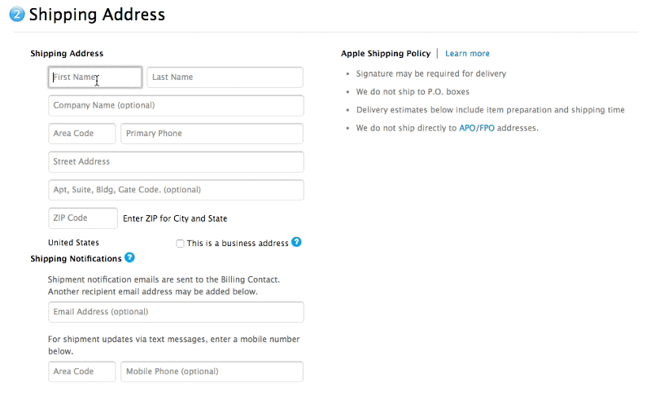
Проверка в магазине Apple производится после ввода данных. (Image: Medium)

Михаэль Коньевич, в своей статье «Проверка в форме: Проектирование взаимодействия», рассматривает различные стратегии проверки и предлагает гибридную стратегию, чтобы удовлетворить обе стороны:

* Награждать рано, наказывать поздно.
* Если пользователь вводит данные в поле, которое было в допустимом состоянии (то есть, введенные данные были действительны), то проверка производится после ввода данных.
* Если пользователь вводит данные в поле, которое было в недопустимом состоянии (то есть, ранее введенные данные были недействительны), то проверка производится во время ввода данных.

Гибридный подход: награждать рано, наказывать поздно. (Image: Medium)
