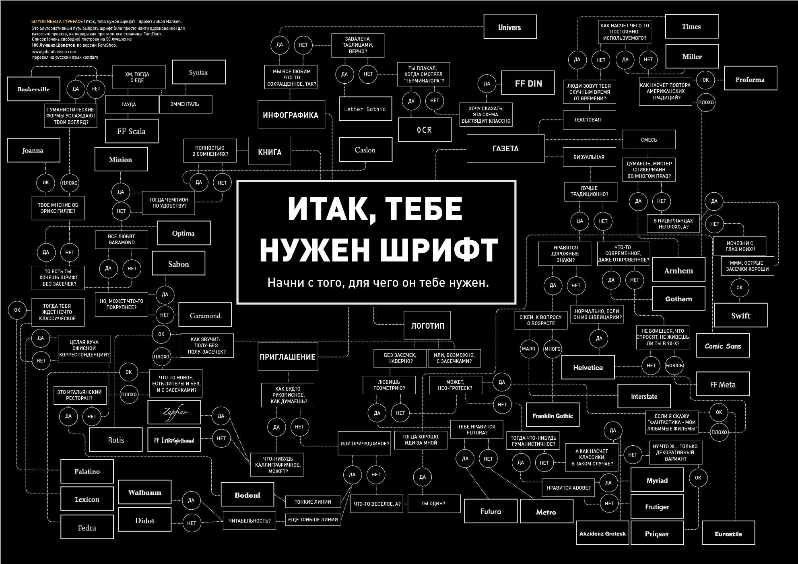
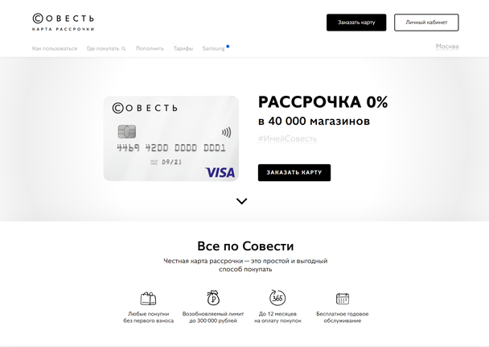
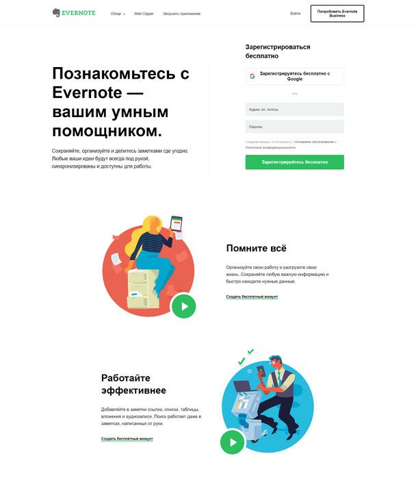

>**[FIX ME]** Не понятно что делать с этой статьей

## Иконки

Иконки должны быть унифицированы и единообразны.
Если разработчик-верстальщик или аналитик не может выбрать для операции подходящую иконку из набора имеющихся - нужно посоветоваться с разработчиком дизайн-среды о создании новой иконки.

Иконка должна быть проста и лаконична. Количество объектов в одной иконке - минимальным.

Иконка должна легко «читаться», содержать минимальное количество элементов. Значимым должно быть всё изображение на иконке, а не только его часть. Поэтому необходимо обращать внимание на контекст, в котором будут использоваться иконки.

**Основное правило:** не использовать текст внутри иконок, он трудночитаемый.

При наведении курсора мыши на иконку сделать всплывающую подсказку и подсветку иконки. При клике оставить подсветку иконки.

При наведении курсора мыши на иконку сделать всплывающую подсказку и подсветку иконки. При клике оставить подсветку иконки.

Изображение на иконке должно быть узнаваемым и понятным. Перед тем, как подобрать метафору для иконки, нужно посмотреть, как это сделано в других продуктах. Лучшим решением будет не придумывать что-то оригинальное, а сделать как везде. Очень важно подобрать изображения, чтобы они соответствовали пользовательскому опыту. Иконки должны быть нарисованы таким образом, чтобы напрямую обращаться к опыту пользователя, без символизма.

Значок плюс чаще означает новое сообщение или новые поступления, чем раскрывающееся меню.

Использование стрелок для указания направления давно стало стандартом. Тривиальное изображение моментально воздействует на опыт посетителя, давая ему представление о возможном движении по сайту.

## Шрифты

Будучи частью фирменного стиля, шрифт ассоциируется с продукцией бренда и является одним из важнейших средств коммуникации компании с потребителями.
Одно и то же слово, набранное разными шрифтами, будет совершенно по-разному восприниматься.

Прямые вытянутые шрифты сообщают деловое настроение и являются практически универсальными шрифтами.

## Отличие восприятия шрифта с засечками и без них

Шрифты с засечками (serif) читаются легче в печатных работах. Засечки увеличивают контраст между буквами и делают их отличительными. Так нашему мозгу легче распознать букву. Читая шрифт без засечек, мозг тратит больше времени на то, чтобы опознать букву, потому что ее форма не такая отличительная.

Шрифты без засечек (sans serif) лучше использовать для интернета. Также такой шрифт хорошо смотрится в наружной рекламе, так как не теряет своих свойств при увеличении. Его часто используют для того, чтобы привлечь внимание. Шрифт без засечек хорошо смотрится и в маленьком размере, но для основного текста лучше использовать с засечками – он не вызывает быстрой усталости.

## Размер шрифта

Для основной версии использовать размер кегля – 11-12 пунктов. Для версии для слабовидящих шрифт 18 кегля и больше.

### Совесть

Заголовок: **50 пикселей**

Подзаголовок: **36 пикселей**

Основной текст: **21 пиксель**

### Geekbrains

Заголовок: **80 пикселей**

Подзаголовок: **24 пикселя**

Основной текст: **15 пикселей**

### Evernote

Заголовок: **60 пикселей**

Подзаголовок: **35 пикселя**

Основной текст: **18 пикселей**

## Длина строки

Разная длина строк может ускорять или замедлять чтение. Необходимо обращать внимание не только на тип шрифта, но и на расстояние между буквами, строчками и т.д.

Переносов в вебе по возможности следует избегать. Нужно перенести слово на новую строку или чуть-чуть изменить кернинг расстояние. Если знаков переноса слишком много, поменять размер шрифта или величину пробелов. При выравнивании текста по левому краю переносы делать не нужно.

## Сочетание шрифтов

В процессе чтения глаза привыкают к основному шрифту и они утомляются, если заголовки, оглавление и второстепенный текст набраны шрифтами разной гарнитуры, не гармонирующими с основным шрифтом. Поэтому, при подборе шрифтов достаточно остановиться на одном–двух шрифтах, а акценты расставлять за счет размера, цвета и начертания.

Работая с целой группой шрифтов, используйте их строго по назначению, не путайте "роли"; если подзаголовок уже набран вами одним шрифтом, то и для остальных подзаголовков применяйте этот же шрифт. Пусть будет видно, для чего предназначен каждый из них.

Когда-то наиболее безопасным вариантом являлись системные шрифты, потому что они всегда в рабочем состоянии и доступны на большинстве устройств. Сегодня нет необходимости идти на компромисс и ограничивать себя этими «рабочими лошадками». Как правило, веб-шрифты так же надежны, как системные шрифты, но предлагают большее разнообразие выбора.

*Попробуйте такие образцы:*

[Proxima Nova, Helvetica, Museo, Futura, Brandon Grotesque](https://www.myfonts.com/topwebfonts/) (популярные)

[Arial, Times New Roman, Courier New, Helvetica, Times, Courier, Verdana, Georgia](https://www.cssfontstack.com/)  (системные)

[Gibson](https://typekit.com/search?query=gibson&amp;utf8=%E2%9C%93), [Gotham](https://www.typography.com/fonts/gotham/overview), [Classic Grotesque](www.monotype.com/fonts/classic-grotesque/), [Montserrat](https://fonts.google.com/specimen/Montserrat) (веб-шрифты)

Если хотите использовать для коротких фрагментов шрифты без  засечек, особенно большого размера, то обычное начертание выглядит в такой роли слегка неуместно. Вместо этого рекомендуется использовать полужирное и сжатое начертания. Если предпочитаете шрифты с засечками, очень тонкие засечки (hairline serifs), то как правило в коротких строках хорошо работают шрифты [Playfair Display](https://fonts.google.com/specimen/Playfair+Display) и [Rufina](https://fonts.google.com/specimen/Rufina), потому что их высокий контраст обычно привлекает внимание читателя.

Выбирайте шрифты, которые имеют классический вид и легки для восприятия. Откажитесь от вычурных шрифтов в пользу простых и практичных. И принимайте во внимание назначение того или иного шрифта: какие-то из них, допустим, больше подходят для заголовков, чем для основного текста.

Что касается сочетаний шрифтов, не делайте их слишком сложными – ограничьтесь тремя разными типами, не больше. Кроме того, подбирайте контрастирующие шрифты. Это поможет направить взгляд пользователя: сначала к заголовку, затем к основному тексту. Также создавать визуальный контраст можно при помощи разных размеров, цветов и начертаний.

## Длина заголовка

Длина строки не должна превышать **600 px**. Это оптимальный размер для комфортного перемещения взгляда с одной строчки на другую. Очень широкую контентную часть тяжело читать — часто просто теряешь ту строчку, на которую собирался перейти после прочтения длинной предыдущей строки. Если все-таки необходимо растянуть текстовый блок на 1000 px и более по ширине, можно попробовать разбить текст на две или более колонок. Другой вариант — сделать межстрочное расстояние чуть больше обычного, чтобы визуально сильнее отделить строки друг от друга. Не забывайте разделять текст абзацами, это также поможет сделать его легко читаемым.

Расстояние между строками практически всегда должно быть больше размера шрифта. За исключением заголовков. Чтобы достигнуть баланса между текстом и «воздухом», сделайте межстрочное расстояние примерно в полтора раза больше высоты строчных букв. Или устанавливаем интерлиньяж, равный 150% размера шрифта.

Например размер текста 14 px, тогда интрерлиньяж — 21 px. 14/2 = 7 + 14 = 21

## Цифры в шрифтах

Если планируете использовать много чисел, имейте в виду, что есть несколько различных стилей для разных контекстов. Цифры Oldstyle предпочтительнее для блоков текста, таких как абзацы.

## Полезные ссылки по шрифтам

[Сочетание шрифтов](https://pomelnikov.com/font-pair#prettyPhoto)

[Про шрифты и нейросеть](https://www.youtube.com/watch?v=-31K2mVR-vA&feature=youtu.be)

[Психология восприятия шрифтов](https://infogra.ru/typography/psihologiya-vospriyatiya-shriftov)

[Подбор шрифтов для сайта (комбинатор шрифтов)](https://pomelnikov.com/fc/)

[Google Fonts](https://fonts.google.com/)

[74 лучших бесплатных шрифтов (англ.)](https://www.creativebloq.com/graphic-design-tips/best-free-fonts-for-designers-1233380)

[Бесплатные ресурсы для типографского дела (англ.)](https://www.invisionapp.com/inside-design/free-typography-resources/)

[Тренды в шрифтах (англ.)](https://www.typewolf.com/)

[Шрифтовые пары (англ.)](https://fontpair.co/)

[Adobe Fonts (англ.)](https://fonts.adobe.com/)

[Fontsquirrel - бесплатные шрифты (англ.)](https://www.fontsquirrel.com/)

[Выбираем веб-шрифты: руководство для начинающих](https://habr.com/ru/post/350966/)

[Определение соотношений шрифтов (англ.)](https://www.modularscale.com/)

[Типографика в вебе](https://habr.com/ru/post/324944/)

## Полезные ссылки по иконкам

[Поиск и генерация иконок (англ.)](https://iconsvg.xyz/)

[Как правильно выбрать иконки](https://www.internet-technologies.ru/articles/kak-pravilno-vybrat-ikonki.html)

[10 ошибок в дизайне иконок](https://habr.com/ru/post/25328/)

[Три точки роста конверсии, или как повысить безопасность и увеличить продажи на сайте](https://habr.com/ru/post/441796/)

[Размещение иконок на странице сайта. Делать проще, поддерживать легче](https://habr.com/ru/post/335632/)

[Доступные шрифты с иконками (англ.)](https://www.filamentgroup.com/lab/bulletproof_icon_fonts.html)

[91,000 бесплатных иконок](https://icons8.ru/icons/)

[Шрифтовые икноки для использования с Bootstrap](https://fontawesome.veliovgroup.com/)

[Иконки в дизайне – возврат к пиктографии](https://spark.ru/startup/pixli/blog/27504/ikonki-v-dizajne-vozvrat-k-piktografii)
